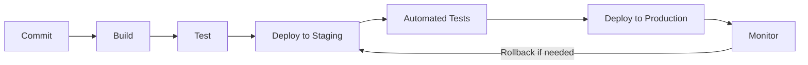
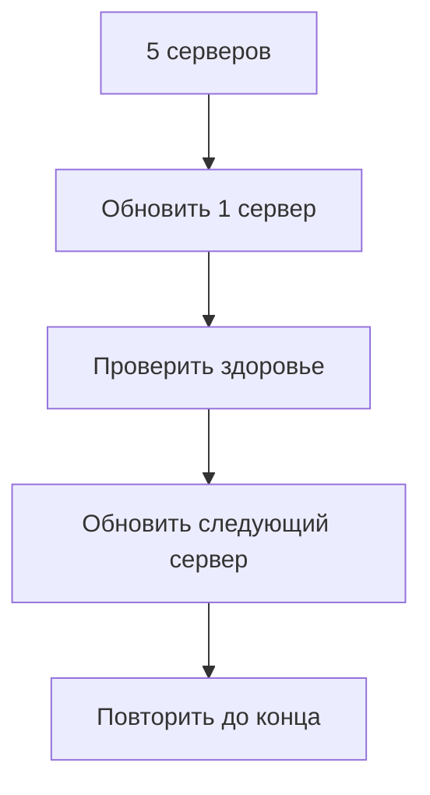
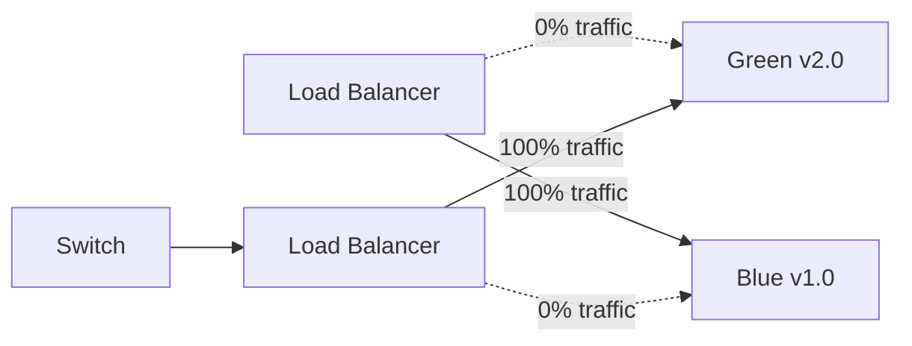
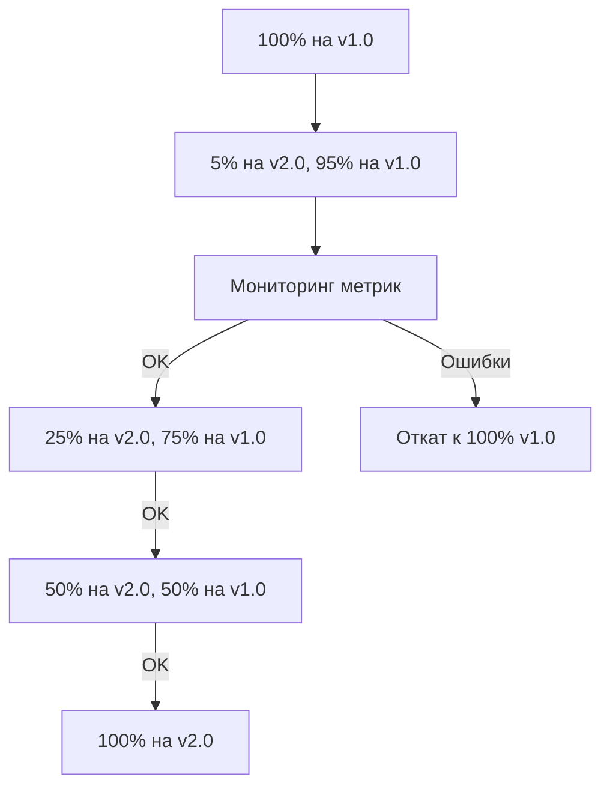

# 🚀 Continuous Deployment (CD)

## 📋 Содержание
- [Что такое CD?](#что-такое-cd)
- [CD vs CD (Delivery vs Deployment)](#cd-vs-cd)
- [Стратегии развёртывания](#стратегии-развёртывания)
- [Инструменты для CD](#инструменты-для-cd)
- [Настройка GitHub Actions](#настройка-github-actions-для-cd)
- [Настройка GitLab CI/CD](#настройка-gitlab-cicd-для-cd)
- [Деплой на различные платформы](#деплой-на-различные-платформы)
- [Автоматизация инфраструктуры](#автоматизация-инфраструктуры)
- [Мониторинг и откаты](#мониторинг-и-откаты)

---

## 🎯 Что такое CD?

**Continuous Deployment (Непрерывное развёртывание)** — это практика автоматического развёртывания каждого изменения, прошедшего все стадии CI, в production-окружение без ручного вмешательства.



### ✅ Преимущества CD:

- 🚀 Быстрая доставка функций пользователям
- 🔄 Частые и небольшие релизы
- 🐛 Быстрое исправление багов
- 📊 Улучшенная обратная связь
- 💪 Повышенная уверенность в релизах

---

## 🔄 CD vs CD (Delivery vs Deployment)

### Continuous Delivery (Непрерывная доставка)

```yaml
# Развёртывание требует ручного подтверждения
Deploy to Production:
  when: manual  # 👈 Ручное подтверждение
  script:
    - ./deploy.sh production
```

**Особенности:**
- ✅ Код всегда готов к развёртыванию
- 👤 Финальное развёртывание требует ручного действия
- 🎯 Больше контроля над релизами
- 📅 Выбор времени развёртывания

### Continuous Deployment (Непрерывное развёртывание)

```yaml
# Автоматическое развёртывание
Deploy to Production:
  when: on_success  # 👈 Автоматически
  script:
    - ./deploy.sh production
```

**Особенности:**
- 🤖 Полная автоматизация
- ⚡ Мгновенное развёртывание после прохождения тестов
- 🚀 Максимальная скорость доставки
- 🔍 Требует отличного покрытия тестами

---

## 🎪 Стратегии развёртывания

### 1️⃣ Rolling Deployment (Последовательное развёртывание)



**Преимущества:**
- ✅ Нет простоя
- ✅ Постепенное обновление
- ✅ Легко откатить

**Недостатки:**
- ⚠️ Медленное развёртывание
- ⚠️ Несовместимость версий в процессе

```yaml
# Kubernetes Rolling Update
apiVersion: apps/v1
kind: Deployment
metadata:
  name: myapp
spec:
  replicas: 5
  strategy:
    type: RollingUpdate
    rollingUpdate:
      maxSurge: 1        # Максимум +1 под
      maxUnavailable: 1  # Максимум 1 недоступен
```

### 2️⃣ Blue-Green Deployment



**Преимущества:**
- ✅ Мгновенное переключение
- ✅ Лёгкий откат
- ✅ Полное тестирование перед переключением

**Недостатки:**
- ⚠️ Требует двойных ресурсов
- ⚠️ Сложность с базами данных

```yaml
# AWS CodeDeploy Blue-Green
DeploymentType: BLUE_GREEN
BlueGreenDeploymentConfiguration:
  TerminateBlueInstancesOnDeploymentSuccess:
    Action: TERMINATE
    TerminationWaitTimeInMinutes: 5
  DeploymentReadyOption:
    ActionOnTimeout: CONTINUE_DEPLOYMENT
```

### 3️⃣ Canary Deployment (Канареечное развёртывание)



**Преимущества:**
- ✅ Минимизация рисков
- ✅ Реальное тестирование на части пользователей
- ✅ Постепенное увеличение нагрузки

**Недостатки:**
- ⚠️ Сложность настройки
- ⚠️ Требует мониторинга

```yaml
# Istio Canary Deployment
apiVersion: networking.istio.io/v1alpha3
kind: VirtualService
metadata:
  name: myapp
spec:
  hosts:
  - myapp
  http:
  - match:
    - headers:
        canary:
          exact: "true"
    route:
    - destination:
        host: myapp
        subset: v2
      weight: 10  # 10% трафика
    - destination:
        host: myapp
        subset: v1
      weight: 90  # 90% трафика
```

### 4️⃣ Feature Flags (Фича-флаги)

```javascript
// Управление функциями через флаги
if (featureFlags.isEnabled('new-checkout')) {
  return <NewCheckout />;
} else {
  return <OldCheckout />;
}
```

**Преимущества:**
- ✅ Включение/выключение функций без деплоя
- ✅ A/B тестирование
- ✅ Постепенный раскат функций

---

## 🛠 Инструменты для CD

### 🌟 Платформы развёртывания

| Инструмент | Тип | Описание |
|------------|-----|----------|
| **Kubernetes** | Оркестрация | Автоматическое управление контейнерами |
| **Docker Swarm** | Оркестрация | Простая альтернатива Kubernetes |
| **AWS ECS/EKS** | Cloud | Amazon контейнерные сервисы |
| **Azure AKS** | Cloud | Microsoft Kubernetes сервис |
| **Google GKE** | Cloud | Google Kubernetes Engine |
| **Heroku** | PaaS | Простой деплой приложений |
| **Vercel** | PaaS | Оптимизирован для фронтенда |
| **Netlify** | PaaS | JAMstack деплой |

### 🔧 Инструменты автоматизации

| Инструмент | Назначение |
|------------|------------|
| **Ansible** | Конфигурация серверов |
| **Terraform** | Infrastructure as Code |
| **Helm** | Пакетный менеджер для Kubernetes |
| **ArgoCD** | GitOps для Kubernetes |
| **Spinnaker** | Multi-cloud CD платформа |
| **Flux** | GitOps оператор |

---

## ⚙️ Настройка GitHub Actions для CD

### 🚀 Деплой на VPS через SSH

```yaml
name: Deploy to Production

on:
  push:
    branches: [main]

jobs:
  deploy:
    runs-on: ubuntu-latest
    environment:
      name: production
      url: https://yourapp.com
    
    steps:
    - name: 📥 Checkout code
      uses: actions/checkout@v4
    
    - name: 🔑 Setup SSH
      uses: webfactory/ssh-agent@v0.8.0
      with:
        ssh-private-key: ${{ secrets.SSH_PRIVATE_KEY }}
    
    - name: 🚀 Deploy to server
      env:
        SERVER_HOST: ${{ secrets.SERVER_HOST }}
        SERVER_USER: ${{ secrets.SERVER_USER }}
      run: |
        ssh -o StrictHostKeyChecking=no $SERVER_USER@$SERVER_HOST << 'EOF'
          cd /var/www/myapp
          git pull origin main
          npm install --production
          npm run build
          pm2 restart myapp
        EOF
    
    - name: 🏥 Health check
      run: |
        sleep 10
        curl --fail https://yourapp.com/health || exit 1
    
    - name: 📢 Notify deployment
      if: always()
      uses: 8398a7/action-slack@v3
      with:
        status: ${{ job.status }}
        text: 'Deployment to production ${{ job.status }}'
      env:
        SLACK_WEBHOOK_URL: ${{ secrets.SLACK_WEBHOOK }}
```

### 🐳 Деплой Docker образа

```yaml
name: Build and Deploy Docker

on:
  push:
    branches: [main]
    tags: ['v*']

env:
  REGISTRY: ghcr.io
  IMAGE_NAME: ${{ github.repository }}

jobs:
  build-and-push:
    runs-on: ubuntu-latest
    permissions:
      contents: read
      packages: write
    
    outputs:
      image-tag: ${{ steps.meta.outputs.tags }}
    
    steps:
    - name: 📥 Checkout
      uses: actions/checkout@v4
    
    - name: 🐳 Set up Docker Buildx
      uses: docker/setup-buildx-action@v3
    
    - name: 🔑 Login to GitHub Container Registry
      uses: docker/login-action@v3
      with:
        registry: ${{ env.REGISTRY }}
        username: ${{ github.actor }}
        password: ${{ secrets.GITHUB_TOKEN }}
    
    - name: 📝 Extract metadata
      id: meta
      uses: docker/metadata-action@v5
      with:
        images: ${{ env.REGISTRY }}/${{ env.IMAGE_NAME }}
        tags: |
          type=ref,event=branch
          type=ref,event=pr
          type=semver,pattern={{version}}
          type=semver,pattern={{major}}.{{minor}}
          type=sha
    
    - name: 🏗️ Build and push
      uses: docker/build-push-action@v5
      with:
        context: .
        push: true
        tags: ${{ steps.meta.outputs.tags }}
        labels: ${{ steps.meta.outputs.labels }}
        cache-from: type=gha
        cache-to: type=gha,mode=max
  
  deploy:
    needs: build-and-push
    runs-on: ubuntu-latest
    
    steps:
    - name: 🚀 Deploy to server
      uses: appleboy/ssh-action@master
      with:
        host: ${{ secrets.SERVER_HOST }}
        username: ${{ secrets.SERVER_USER }}
        key: ${{ secrets.SSH_PRIVATE_KEY }}
        script: |
          cd /opt/myapp
          docker-compose pull
          docker-compose up -d
          docker system prune -af
```

### ☸️ Деплой в Kubernetes

```yaml
name: Deploy to Kubernetes

on:
  push:
    branches: [main]

jobs:
  deploy:
    runs-on: ubuntu-latest
    
    steps:
    - name: 📥 Checkout
      uses: actions/checkout@v4
    
    - name: ☸️ Configure kubectl
      uses: azure/k8s-set-context@v3
      with:
        method: kubeconfig
        kubeconfig: ${{ secrets.KUBE_CONFIG }}
    
    - name: 🚀 Deploy to cluster
      run: |
        kubectl set image deployment/myapp \
          myapp=${{ env.REGISTRY }}/${{ env.IMAGE_NAME }}:${{ github.sha }}
        kubectl rollout status deployment/myapp
    
    - name: 🏥 Verify deployment
      run: |
        kubectl get pods -l app=myapp
        kubectl get service myapp
```

---

## 🦊 Настройка GitLab CI/CD для CD

### 📄 Полный пайплайн с несколькими окружениями

```yaml
stages:
  - build
  - test
  - staging
  - production

variables:
  DOCKER_IMAGE: $CI_REGISTRY_IMAGE:$CI_COMMIT_SHA

# === BUILD ===
build:
  stage: build
  image: docker:latest
  services:
    - docker:dind
  before_script:
    - docker login -u $CI_REGISTRY_USER -p $CI_REGISTRY_PASSWORD $CI_REGISTRY
  script:
    - docker build -t $DOCKER_IMAGE .
    - docker push $DOCKER_IMAGE
  only:
    - main
    - develop

# === TEST ===
test:
  stage: test
  image: $DOCKER_IMAGE
  script:
    - npm test
    - npm run e2e

# === STAGING ===
deploy:staging:
  stage: staging
  image: alpine:latest
  before_script:
    - apk add --no-cache openssh-client
    - eval $(ssh-agent -s)
    - echo "$SSH_PRIVATE_KEY" | tr -d '\r' | ssh-add -
    - mkdir -p ~/.ssh
    - chmod 700 ~/.ssh
  script:
    - ssh -o StrictHostKeyChecking=no $STAGING_USER@$STAGING_HOST << EOF
        docker pull $DOCKER_IMAGE
        docker stop myapp-staging || true
        docker rm myapp-staging || true
        docker run -d --name myapp-staging \
          -p 3000:3000 \
          -e NODE_ENV=staging \
          $DOCKER_IMAGE
      EOF
  environment:
    name: staging
    url: https://staging.yourapp.com
  only:
    - develop

# === PRODUCTION ===
deploy:production:
  stage: production
  image: alpine:latest
  before_script:
    - apk add --no-cache openssh-client
    - eval $(ssh-agent -s)
    - echo "$SSH_PRIVATE_KEY" | tr -d '\r' | ssh-add -
  script:
    - ssh -o StrictHostKeyChecking=no $PROD_USER@$PROD_HOST << EOF
        docker pull $DOCKER_IMAGE
        
        # Blue-Green deployment
        docker tag $DOCKER_IMAGE myapp:green
        
        # Start green
        docker run -d --name myapp-green \
          -p 3001:3000 \
          -e NODE_ENV=production \
          myapp:green
        
        # Health check
        sleep 10
        curl --fail http://localhost:3001/health
        
        # Switch traffic (update nginx/load balancer)
        # ...
        
        # Stop blue
        docker stop myapp-blue || true
        docker rm myapp-blue || true
        
        # Rename green to blue for next deployment
        docker rename myapp-green myapp-blue
      EOF
  environment:
    name: production
    url: https://yourapp.com
  when: manual  # Требует ручного подтверждения
  only:
    - main
```

### 🎯 Canary Deployment в GitLab

```yaml
# Canary deployment с постепенным увеличением трафика
.deploy_template: &deploy_template
  image: google/cloud-sdk:alpine
  script:
    - echo $GCP_SERVICE_KEY | base64 -d > ${HOME}/gcp-key.json
    - gcloud auth activate-service-account --key-file ${HOME}/gcp-key.json
    - gcloud container clusters get-credentials $GKE_CLUSTER --zone $GKE_ZONE

deploy:canary:10:
  <<: *deploy_template
  stage: canary
  script:
    - kubectl set image deployment/myapp myapp=$DOCKER_IMAGE
    - kubectl patch deployment myapp -p '{"spec":{"replicas":1}}'  # 10% трафика
  environment:
    name: production-canary-10
  only:
    - main

deploy:canary:50:
  <<: *deploy_template
  stage: canary
  script:
    - kubectl scale deployment myapp --replicas=5  # 50% трафика
  environment:
    name: production-canary-50
  when: manual
  only:
    - main

deploy:production:100:
  <<: *deploy_template
  stage: production
  script:
    - kubectl scale deployment myapp --replicas=10  # 100% трафика
  environment:
    name: production
  when: manual
  only:
    - main
```

---

## 🌍 Деплой на различные платформы

### ☁️ AWS (EC2, ECS, Lambda)

#### AWS EC2 через CodeDeploy

```yaml
# .github/workflows/aws-deploy.yml
name: Deploy to AWS

on:
  push:
    branches: [main]

jobs:
  deploy:
    runs-on: ubuntu-latest
    
    steps:
    - uses: actions/checkout@v4
    
    - name: Configure AWS credentials
      uses: aws-actions/configure-aws-credentials@v4
      with:
        aws-access-key-id: ${{ secrets.AWS_ACCESS_KEY_ID }}
        aws-secret-access-key: ${{ secrets.AWS_SECRET_ACCESS_KEY }}
        aws-region: us-east-1
    
    - name: Deploy to CodeDeploy
      run: |
        aws deploy create-deployment \
          --application-name MyApp \
          --deployment-group-name MyDeploymentGroup \
          --github-location repository=${{ github.repository }},commitId=${{ github.sha }}
```

#### AWS Lambda

```yaml
deploy-lambda:
  runs-on: ubuntu-latest
  steps:
    - uses: actions/checkout@v4
    
    - name: Setup Node.js
      uses: actions/setup-node@v4
      with:
        node-version: '18'
    
    - name: Install dependencies
      run: npm ci --production
    
    - name: Zip function
      run: zip -r function.zip .
    
    - name: Configure AWS
      uses: aws-actions/configure-aws-credentials@v4
      with:
        aws-access-key-id: ${{ secrets.AWS_ACCESS_KEY_ID }}
        aws-secret-access-key: ${{ secrets.AWS_SECRET_ACCESS_KEY }}
        aws-region: us-east-1
    
    - name: Deploy to Lambda
      run: |
        aws lambda update-function-code \
          --function-name my-function \
          --zip-file fileb://function.zip
```

### 🔷 Azure

```yaml
# Azure Web App
deploy-azure:
  runs-on: ubuntu-latest
  steps:
    - uses: actions/checkout@v4
    
    - name: Login to Azure
      uses: azure/login@v1
      with:
        creds: ${{ secrets.AZURE_CREDENTIALS }}
    
    - name: Deploy to Azure Web App
      uses: azure/webapps-deploy@v2
      with:
        app-name: 'my-webapp'
        package: .
```

### 🟦 Google Cloud Platform

```yaml
# Google Cloud Run
deploy-gcp:
  runs-on: ubuntu-latest
  steps:
    - uses: actions/checkout@v4
    
    - name: Setup Cloud SDK
      uses: google-github-actions/setup-gcloud@v1
      with:
        service_account_key: ${{ secrets.GCP_SA_KEY }}
        project_id: ${{ secrets.GCP_PROJECT_ID }}
    
    - name: Build and Deploy to Cloud Run
      run: |
        gcloud builds submit --tag gcr.io/${{ secrets.GCP_PROJECT_ID }}/myapp
        gcloud run deploy myapp \
          --image gcr.io/${{ secrets.GCP_PROJECT_ID }}/myapp \
          --platform managed \
          --region us-central1 \
          --allow-unauthenticated
```

### 🟣 Heroku

```yaml
# Heroku deployment
deploy-heroku:
  runs-on: ubuntu-latest
  steps:
    - uses: actions/checkout@v4
    
    - name: Deploy to Heroku
      uses: akhileshns/heroku-deploy@v3.12.14
      with:
        heroku_api_key: ${{ secrets.HEROKU_API_KEY }}
        heroku_app_name: "my-app"
        heroku_email: "your-email@example.com"
```

### ▲ Vercel

```yaml
# Vercel deployment
deploy-vercel:
  runs-on: ubuntu-latest
  steps:
    - uses: actions/checkout@v4
    
    - name: Deploy to Vercel
      uses: amondnet/vercel-action@v25
      with:
        vercel-token: ${{ secrets.VERCEL_TOKEN }}
        vercel-org-id: ${{ secrets.VERCEL_ORG_ID }}
        vercel-project-id: ${{ secrets.VERCEL_PROJECT_ID }}
        vercel-args: '--prod'
```

### 🟩 Netlify

```yaml
# Netlify deployment
deploy-netlify:
  runs-on: ubuntu-latest
  steps:
    - uses: actions/checkout@v4
    
    - name: Build
      run: npm run build
    
    - name: Deploy to Netlify
      uses: nwtgck/actions-netlify@v2.0
      with:
        publish-dir: './dist'
        production-branch: main
        github-token: ${{ secrets.GITHUB_TOKEN }}
        deploy-message: "Deploy from GitHub Actions"
      env:
        NETLIFY_AUTH_TOKEN: ${{ secrets.NETLIFY_AUTH_TOKEN }}
        NETLIFY_SITE_ID: ${{ secrets.NETLIFY_SITE_ID }}
```

---

## 🏗 Автоматизация инфраструктуры

### Terraform для создания инфраструктуры

```hcl
# main.tf
terraform {
  required_providers {
    aws = {
      source  = "hashicorp/aws"
      version = "~> 5.0"
    }
  }
  
  backend "s3" {
    bucket = "myapp-terraform-state"
    key    = "prod/terraform.tfstate"
    region = "us-east-1"
  }
}

provider "aws" {
  region = "us-east-1"
}

# EC2 Instance
resource "aws_instance" "app_server" {
  ami           = "ami-0c55b159cbfafe1f0"
  instance_type = "t2.micro"
  
  tags = {
    Name = "MyAppServer"
    Environment = "Production"
  }
}

# Load Balancer
resource "aws_lb" "app_lb" {
  name               = "myapp-lb"
  internal           = false
  load_balancer_type = "application"
  subnets            = aws_subnet.public[*].id
}
```

```yaml
# GitHub Actions для Terraform
name: Terraform Deploy

on:
  push:
    branches: [main]
    paths:
      - 'terraform/**'

jobs:
  terraform:
    runs-on: ubuntu-latest
    
    steps:
    - uses: actions/checkout@v4
    
    - name: Setup Terraform
      uses: hashicorp/setup-terraform@v2
    
    - name: Terraform Init
      run: terraform init
      working-directory: ./terraform
    
    - name: Terraform Plan
      run: terraform plan
      working-directory: ./terraform
      env:
        AWS_ACCESS_KEY_ID: ${{ secrets.AWS_ACCESS_KEY_ID }}
        AWS_SECRET_ACCESS_KEY: ${{ secrets.AWS_SECRET_ACCESS_KEY }}
    
    - name: Terraform Apply
      if: github.ref == 'refs/heads/main'
      run: terraform apply -auto-approve
      working-directory: ./terraform
      env:
        AWS_ACCESS_KEY_ID: ${{ secrets.AWS_ACCESS_KEY_ID }}
        AWS_SECRET_ACCESS_KEY: ${{ secrets.AWS_SECRET_ACCESS_KEY }}
```

### Ansible для конфигурации серверов

```yaml
# playbook.yml
---
- name: Deploy Application
  hosts: production
  become: yes
  
  vars:
    app_name: myapp
    app_port: 3000
    node_version: "18"
  
  tasks:
    - name: Update apt cache
      apt:
        update_cache: yes
    
    - name: Install Node.js
      shell: |
        curl -fsSL https://deb.nodesource.com/setup_{{ node_version }}.x | bash -
        apt-get install -y nodejs
    
    - name: Install PM2
      npm:
        name: pm2
        global: yes
    
    - name: Clone repository
      git:
        repo: 'https://github.com/username/{{ app_name }}.git'
        dest: '/var/www/{{ app_name }}'
        version: main
    
    - name: Install dependencies
      npm:
        path: '/var/www/{{ app_name }}'
        production: yes
    
    - name: Start application
      command: pm2 start app.js --name {{ app_name }}
      args:
        chdir: '/var/www/{{ app_name }}'
    
    - name: Save PM2 configuration
      command: pm2 save
    
    - name: Setup PM2 startup
      command: pm2 startup systemd -u deployer --hp /home/deployer
```

```yaml
# GitHub Actions для Ansible
name: Deploy with Ansible

on:
  push:
    branches: [main]

jobs:
  deploy:
    runs-on: ubuntu-latest
    
    steps:
    - uses: actions/checkout@v4
    
    - name: Install Ansible
      run: |
        sudo apt update
        sudo apt install -y ansible
    
    - name: Setup SSH
      run: |
        mkdir -p ~/.ssh
        echo "${{ secrets.SSH_PRIVATE_KEY }}" > ~/.ssh/id_rsa
        chmod 600 ~/.ssh/id_rsa
        ssh-keyscan -H ${{ secrets.SERVER_HOST }} >> ~/.ssh/known_hosts
    
    - name: Run Ansible Playbook
      run: |
        ansible-playbook -i inventory.ini playbook.yml
      env:
        ANSIBLE_HOST_KEY_CHECKING: False
```

---

## 📊 Мониторинг и откаты

### Мониторинг развёртывания

```yaml
# Healthcheck после деплоя
deploy:
  script:
    - ./deploy.sh
    
    # Ждём запуска
    - sleep 30
    
    # Проверяем здоровье
    - |
      for i in {1..10}; do
        if curl --fail https://yourapp.com/health; then
          echo "✅ Health check passed"
          exit 0
        fi
        echo "⏳ Waiting for app to start..."
        sleep 10
      done
      echo "❌ Health check failed"
      exit 1
```

### Автоматический откат

```yaml
# GitLab Auto Rollback
production:
  stage: deploy
  script:
    - ./deploy.sh
  environment:
    name: production
    url: https://yourapp.com
    on_stop: rollback_production

rollback_production:
  stage: deploy
  script:
    - ./rollback.sh
  environment:
    name: production
    action: stop
  when: manual
```

```bash
# rollback.sh
#!/bin/bash

echo "🔄 Starting rollback..."

# Получаем предыдущий образ
PREVIOUS_IMAGE=$(docker images --format "{{.Repository}}:{{.Tag}}" | grep myapp | sed -n '2p')

# Останавливаем текущий
docker stop myapp-current

# Запускаем предыдущий
docker run -d --name myapp-current \
  -p 3000:3000 \
  $PREVIOUS_IMAGE

echo "✅ Rollback complete"
```

### Интеграция с Sentry для мониторинга ошибок

```yaml
deploy:
  script:
    - ./deploy.sh
    
    # Создаём релиз в Sentry
    - |
      curl -X POST \
        https://sentry.io/api/0/organizations/myorg/releases/ \
        -H "Authorization: Bearer $SENTRY_AUTH_TOKEN" \
        -H "Content-Type: application/json" \
        -d "{
          \"version\": \"$CI_COMMIT_SHA\",
          \"projects\": [\"myapp\"]
        }"
    
    # Отмечаем деплой
    - |
      curl -X POST \
        https://sentry.io/api/0/organizations/myorg/releases/$CI_COMMIT_SHA/deploys/ \
        -H "Authorization: Bearer $SENTRY_AUTH_TOKEN" \
        -H "Content-Type: application/json" \
        -d "{
          \"environment\": \"production\"
        }"
```

---

## 🔐 Безопасность при развёртывании

### Управление секретами

```yaml
# Использование секретов из хранилища
deploy:
  script:
    # AWS Secrets Manager
    - |
      SECRET=$(aws secretsmanager get-secret-value \
        --secret-id prod/myapp/db \
        --query SecretString \
        --output text)
    
    # HashiCorp Vault
    - |
      export VAULT_TOKEN=$VAULT_TOKEN
      SECRET=$(vault kv get -field=password secret/prod/db)
    
    # Передаём в приложение
    - docker run -e DB_PASSWORD="$SECRET" myapp
```

### Подписание образов

```yaml
# Docker Content Trust
deploy:
  before_script:
    - export DOCKER_CONTENT_TRUST=1
    - echo "$DOCKER_TRUST_KEY" | docker trust key load
  
  script:
    - docker build -t myapp:$VERSION .
    - docker trust sign myapp:$VERSION
    - docker push myapp:$VERSION
```

---

## 💡 Лучшие практики CD

### ✅ Рекомендации

1. **Автоматизируйте всё**
   ```yaml
   # Автоматические тесты перед деплоем
   before_script:
     - npm test
     - npm run security-scan
     - npm run performance-test
   ```

2. **Используйте окружения**
   ```yaml
   environments:
     - dev
     - staging
     - production
   ```

3. **Внедряйте постепенно**
   ```
   Dev → Staging → Canary (10%) → Production (100%)
   ```

4. **Мониторьте всё**
   - Логи приложения
   - Метрики производительности
   - Ошибки пользователей
   - Использование ресурсов

5. **Готовьтесь к откатам**
   ```bash
   # Всегда имейте план B
   ./deploy.sh || ./rollback.sh
   ```

### ❌ Частые ошибки

1. **Деплой без тестов** ❌
   ```yaml
   # ПЛОХО
   deploy:
     script: ./deploy.sh
   ```

2. **Отсутствие health checks** ❌
   ```yaml
   # ПЛОХО - деплой без проверки
   deploy:
     script:
       - ./deploy.sh
       - echo "Done"  # Не знаем, работает ли
   ```

3. **Хранение секретов в коде** ❌
   ```yaml
   # ПЛОХО
   env:
     DATABASE_PASSWORD: "password123"
   ```

4. **Деплой напрямую в production** ❌
   ```yaml
   # ПЛОХО - нет staging окружения
   main → production
   ```

---

## 🎓 Примеры полных пайплайнов

### Node.js приложение (полный цикл)

```yaml
name: Complete CI/CD Pipeline

on:
  push:
    branches: [main, develop]
  pull_request:
    branches: [main]

env:
  NODE_VERSION: '18'
  REGISTRY: ghcr.io
  IMAGE_NAME: ${{ github.repository }}

jobs:
  # === CI JOBS ===
  lint:
    runs-on: ubuntu-latest
    steps:
      - uses: actions/checkout@v4
      - uses: actions/setup-node@v4
        with:
          node-version: ${{ env.NODE_VERSION }}
      - run: npm ci
      - run: npm run lint

  test:
    runs-on: ubuntu-latest
    steps:
      - uses: actions/checkout@v4
      - uses: actions/setup-node@v4
        with:
          node-version: ${{ env.NODE_VERSION }}
      - run: npm ci
      - run: npm test
      - run: npm run test:e2e

  security:
    runs-on: ubuntu-latest
    steps:
      - uses: actions/checkout@v4
      - uses: actions/setup-node@v4
        with:
          node-version: ${{ env.NODE_VERSION }}
      - run: npm audit --audit-level=high
      - run: npm run security-scan

  build:
    needs: [lint, test, security]
    runs-on: ubuntu-latest
    steps:
      - uses: actions/checkout@v4
      - uses: actions/setup-node@v4
        with:
          node-version: ${{ env.NODE_VERSION }}
      - run: npm ci
      - run: npm run build
      - uses: actions/upload-artifact@v4
        with:
          name: build
          path: dist/

  # === CD JOBS ===
  deploy-staging:
    needs: build
    if: github.ref == 'refs/heads/develop'
    runs-on: ubuntu-latest
    environment:
      name: staging
      url: https://staging.yourapp.com
    
    steps:
      - uses: actions/checkout@v4
      - uses: actions/download-artifact@v4
        with:
          name: build
          path: dist/
      
      - name: Deploy to Staging
        uses: appleboy/ssh-action@master
        with:
          host: ${{ secrets.STAGING_HOST }}
          username: ${{ secrets.STAGING_USER }}
          key: ${{ secrets.SSH_PRIVATE_KEY }}
          script: |
            cd /var/www/staging
            git pull
            npm install --production
            pm2 restart staging
      
      - name: Health Check
        run: |
          sleep 10
          curl --fail https://staging.yourapp.com/health

  deploy-production:
    needs: build
    if: github.ref == 'refs/heads/main'
    runs-on: ubuntu-latest
    environment:
      name: production
      url: https://yourapp.com
    
    steps:
      - uses: actions/checkout@v4
      - uses: actions/download-artifact@v4
        with:
          name: build
          path: dist/
      
      - name: Deploy to Production
        uses: appleboy/ssh-action@master
        with:
          host: ${{ secrets.PROD_HOST }}
          username: ${{ secrets.PROD_USER }}
          key: ${{ secrets.SSH_PRIVATE_KEY }}
          script: |
            cd /var/www/production
            
            # Backup current version
            tar -czf backup-$(date +%Y%m%d-%H%M%S).tar.gz .
            
            # Deploy new version
            git pull
            npm install --production
            npm run build
            
            # Restart with zero-downtime
            pm2 reload production
      
      - name: Health Check
        run: |
          sleep 10
          for i in {1..5}; do
            if curl --fail https://yourapp.com/health; then
              echo "✅ Production is healthy"
              exit 0
            fi
            echo "Retrying..."
            sleep 5
          done
          exit 1
      
      - name: Notify team
        if: always()
        uses: 8398a7/action-slack@v3
        with:
          status: ${{ job.status }}
          text: |
            Deployment to Production: ${{ job.status }}
            Commit: ${{ github.sha }}
            Author: ${{ github.actor }}
        env:
          SLACK_WEBHOOK_URL: ${{ secrets.SLACK_WEBHOOK }}
```

---

## 📚 Полезные ресурсы

- [GitHub Actions Docs](https://docs.github.com/en/actions)
- [GitLab CI/CD Docs](https://docs.gitlab.com/ee/ci/)
- [Kubernetes Docs](https://kubernetes.io/docs/)
- [Docker Docs](https://docs.docker.com/)
- [Terraform Docs](https://www.terraform.io/docs)
- [Ansible Docs](https://docs.ansible.com/)

---

## 🆘 Troubleshooting

### Проблема: Деплой завис

```bash
# Проверьте процессы
ps aux | grep deploy

# Проверьте логи
tail -f /var/log/deploy.log

# Убейте зависший процесс
pkill -f deploy.sh
```

### Проблема: Приложение не запускается после деплоя

```bash
# Проверьте логи приложения
pm2 logs myapp --lines 100

# Проверьте системные логи
sudo journalctl -u myapp -n 100

# Проверьте Docker логи
docker logs myapp-container
```

### Проблема: База данных не мигрировала

```bash
# Откатите миграции
npm run migrate:rollback

# Запустите снова
npm run migrate:latest

# Проверьте статус
npm run migrate:status
```

---

**Дата создания:** 31.01.2026  
**Версия:** 1.0.0

🚀 *Успешных деплоев!*