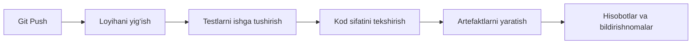

# 🔄 Continuous Integration (CI)


## 📋 Mundarija
- [CI nima?](#ci-nima)
- [CI ning asosiy vazifalari](#ci-ning-asosiy-vazifalari)
- [CI uchun vositalar](#ci-uchun-vositalar)
- [GitHub Actions sozlash](#github-actions-sozlash)
- [GitLab CI sozlash](#gitlab-ci-sozlash)
- [Konfiguratsiya misollari](#konfiguratsiya-misollari)
- [Eng yaxshi amaliyotlar](#eng-yaxshi-amaliyotlar)

---

## 🎯 CI nima?

**Continuous Integration (Uzluksiz integratsiya)** — bu ishlab chiqish amaliyoti bo‘lib, unda dasturchilar o‘z kodlarini muntazam ravishda umumiy repozitoriyga integratsiya qiladilar. Har bir integratsiya avtomatlashtirilgan yig‘ish va testlar yordamida avtomatik ravishda tekshiriladi.

### ✅ Asosiy afzalliklari:
- Xatolarni erta aniqlash
- Kod sifatini yaxshilash
- Ishlab chiqishni tezlashtirish
- Integratsiya jarayonidagi xavflarni kamaytirish
- Rutin vazifalarni avtomatlashtirish

---

## 🎪 CI ning asosiy vazifalari



### 1️⃣ **Loyihani yig‘ish (Build)**
- Boshlang‘ich kodni kompilyatsiya qilish
- Bog‘liqliklarni o‘rnatish
- Konfiguratsiya fayllarini generatsiya qilish

### 2️⃣ **Testlash (Testing)**
- Unit-testlar
- Integratsion testlar
- E2E testlar
- Xavfsizlik testlari

### 3️⃣ **Kod sifatini tekshirish (Code Quality)**
- Kodni statik tahlil qilish (Linting)
- Kod uslubini tekshirish
- Testlar bilan qamrovni tahlil qilish
- Zaifliklarni aniqlash

### 4️⃣ **Artefaktlarni yaratish (Artifacts)**
- Docker-imijlar
- Ijro etiladigan fayllar
- Ilova bilan arxivlar

---

## 🛠 CI uchun vositalar

### 🌟 Mashhur CI platformalari

<p align="center">
    
    
    
    
  
</p>


### 🔧 Qo‘shimcha vositalar

**Testlash uchun:**
- Jest, Mocha, Pytest
- Selenium, Cypress
- JUnit, TestNG

**Kod tekshiruvi uchun:**
- ESLint, Pylint, RuboCop
- SonarQube
- CodeClimate

**Yig‘ish (build) uchun:**
- Maven, Gradle
- npm, yarn, pip
- Docker

---

## ⚙️ GitHub Actions sozlash

### 📁 Loyiha tuzilmasi


```
your-project/
├── .github/
│   └── workflows/
│       ├── ci.yml
│       ├── test.yml
│       └── build.yml
├── src/
├── tests/
└── package.json
```

### 🚀 Базовая конфигурация CI

Создайте файл `.github/workflows/ci.yml`:

```yaml
name: CI Pipeline

# Когда запускать
on:
  push:
    branches: [ main, develop ]
  pull_request:
    branches: [ main, develop ]

# Задачи
jobs:
  build-and-test:
    runs-on: ubuntu-latest
    
    strategy:
      matrix:
        node-version: [16.x, 18.x, 20.x]
    
    steps:
    # Шаг 1: Клонирование репозитория
    - name: 📥 Checkout code
      uses: actions/checkout@v4
    
    # Шаг 2: Настройка Node.js
    - name: 🟢 Setup Node.js ${{ matrix.node-version }}
      uses: actions/setup-node@v4
      with:
        node-version: ${{ matrix.node-version }}
        cache: 'npm'
    
    # Шаг 3: Установка зависимостей
    - name: 📦 Install dependencies
      run: npm ci
    
    # Шаг 4: Линтинг кода
    - name: 🔍 Lint code
      run: npm run lint
    
    # Шаг 5: Запуск тестов
    - name: 🧪 Run tests
      run: npm test
    
    # Шаг 6: Проверка покрытия
    - name: 📊 Check coverage
      run: npm run coverage
    
    # Шаг 7: Загрузка отчёта о покрытии
    - name: 📤 Upload coverage to Codecov
      uses: codecov/codecov-action@v3
      with:
        file: ./coverage/coverage-final.json
    
    # Шаг 8: Сборка проекта
    - name: 🏗️ Build project
      run: npm run build
    
    # Шаг 9: Сохранение артефактов
    - name: 💾 Upload build artifacts
      uses: actions/upload-artifact@v4
      with:
        name: build-${{ matrix.node-version }}
        path: dist/
```

### 🔐 Работа с секретами

#### Добавление секретов в GitHub:

1. Перейдите в **Settings** → **Secrets and variables** → **Actions**
2. Нажмите **New repository secret**
3. Добавьте секреты (например, API токены, пароли)

#### Использование в workflow:

```yaml
steps:
  - name: Deploy
    env:
      API_TOKEN: ${{ secrets.API_TOKEN }}
      DB_PASSWORD: ${{ secrets.DB_PASSWORD }}
    run: |
      echo "Deploying with token..."
```

### 🐳 CI с Docker

```yaml
name: Docker CI

on: [push, pull_request]

jobs:
  docker-build:
    runs-on: ubuntu-latest
    
    steps:
    - name: 📥 Checkout code
      uses: actions/checkout@v4
    
    - name: 🐳 Set up Docker Buildx
      uses: docker/setup-buildx-action@v3
    
    - name: 🔑 Login to Docker Hub
      uses: docker/login-action@v3
      with:
        username: ${{ secrets.DOCKER_USERNAME }}
        password: ${{ secrets.DOCKER_PASSWORD }}
    
    - name: 🏗️ Build and push
      uses: docker/build-push-action@v5
      with:
        context: .
        push: true
        tags: yourusername/yourapp:latest
        cache-from: type=gha
        cache-to: type=gha,mode=max
```

---

## 🦊 Настройка GitLab CI

### 📄 Базовая конфигурация `.gitlab-ci.yml`

```yaml
# Определение стадий
stages:
  - build
  - test
  - quality
  - package

# Переменные
variables:
  NODE_VERSION: "18"
  DOCKER_IMAGE: "node:${NODE_VERSION}-alpine"

# Кэширование зависимостей
cache:
  key: ${CI_COMMIT_REF_SLUG}
  paths:
    - node_modules/
    - .npm/

# Установка зависимостей (выполняется перед каждым job)
before_script:
  - npm ci --cache .npm --prefer-offline

# === СТАДИЯ BUILD ===
build:
  stage: build
  image: $DOCKER_IMAGE
  script:
    - npm run build
  artifacts:
    paths:
      - dist/
    expire_in: 1 week

# === СТАДИЯ TEST ===
unit-tests:
  stage: test
  image: $DOCKER_IMAGE
  script:
    - npm run test:unit
  coverage: '/Statements\s*:\s*(\d+\.\d+)%/'
  artifacts:
    reports:
      junit: junit.xml
      coverage_report:
        coverage_format: cobertura
        path: coverage/cobertura-coverage.xml

integration-tests:
  stage: test
  image: $DOCKER_IMAGE
  services:
    - postgres:14
  variables:
    POSTGRES_DB: test_db
    POSTGRES_USER: test_user
    POSTGRES_PASSWORD: test_password
  script:
    - npm run test:integration

# === СТАДИЯ QUALITY ===
lint:
  stage: quality
  image: $DOCKER_IMAGE
  script:
    - npm run lint

security-scan:
  stage: quality
  image: $DOCKER_IMAGE
  script:
    - npm audit --audit-level=moderate
  allow_failure: true

# === СТАДИЯ PACKAGE ===
docker-build:
  stage: package
  image: docker:latest
  services:
    - docker:dind
  before_script:
    - docker login -u $CI_REGISTRY_USER -p $CI_REGISTRY_PASSWORD $CI_REGISTRY
  script:
    - docker build -t $CI_REGISTRY_IMAGE:$CI_COMMIT_SHA .
    - docker push $CI_REGISTRY_IMAGE:$CI_COMMIT_SHA
  only:
    - main
    - develop
```

### 🎯 GitLab Runner на своём сервере

#### Установка GitLab Runner:

```bash
# Debian/Ubuntu
curl -L "https://packages.gitlab.com/install/repositories/runner/gitlab-runner/script.deb.sh" | sudo bash
sudo apt-get install gitlab-runner

# CentOS/RHEL
curl -L "https://packages.gitlab.com/install/repositories/runner/gitlab-runner/script.rpm.sh" | sudo bash
sudo yum install gitlab-runner
```

#### Регистрация Runner:

```bash
sudo gitlab-runner register \
  --url https://gitlab.com/ \
  --registration-token YOUR_TOKEN \
  --executor docker \
  --docker-image alpine:latest \
  --description "My Docker Runner" \
  --tag-list "docker,linux"
```

---

## 📚 Примеры конфигураций

### Python проект (GitHub Actions)

```yaml
name: Python CI

on: [push, pull_request]

jobs:
  test:
    runs-on: ubuntu-latest
    strategy:
      matrix:
        python-version: ['3.8', '3.9', '3.10', '3.11']
    
    steps:
    - uses: actions/checkout@v4
    
    - name: Set up Python ${{ matrix.python-version }}
      uses: actions/setup-python@v4
      with:
        python-version: ${{ matrix.python-version }}
    
    - name: Install dependencies
      run: |
        python -m pip install --upgrade pip
        pip install -r requirements.txt
        pip install pytest pytest-cov flake8
    
    - name: Lint with flake8
      run: |
        flake8 . --count --select=E9,F63,F7,F82 --show-source --statistics
    
    - name: Test with pytest
      run: |
        pytest --cov=./ --cov-report=xml
    
    - name: Upload coverage
      uses: codecov/codecov-action@v3
```

### Java проект (GitLab CI)

```yaml
image: maven:3.8-openjdk-17

stages:
  - build
  - test
  - package

variables:
  MAVEN_OPTS: "-Dmaven.repo.local=$CI_PROJECT_DIR/.m2/repository"

cache:
  paths:
    - .m2/repository

build:
  stage: build
  script:
    - mvn compile

test:
  stage: test
  script:
    - mvn test
  artifacts:
    reports:
      junit: target/surefire-reports/TEST-*.xml

package:
  stage: package
  script:
    - mvn package -DskipTests
  artifacts:
    paths:
      - target/*.jar
```

---

## 💡 Лучшие практики

### ✅ DO (Делайте так)

```yaml
# ✅ Используйте кэширование
cache:
  paths:
    - node_modules/

# ✅ Разделяйте на этапы
stages:
  - test
  - build
  - deploy

# ✅ Используйте матрицы для тестирования на разных версиях
strategy:
  matrix:
    node: [16, 18, 20]

# ✅ Сохраняйте артефакты
artifacts:
  paths:
    - dist/
  expire_in: 7 days

# ✅ Настройте правильные триггеры
on:
  push:
    branches: [main]
  pull_request:
    branches: [main]
```

### ❌ DON'T (Избегайте)

```yaml
# ❌ Не храните секреты в коде
password: "mypassword123"  # ПЛОХО!

# ❌ Не запускайте CI на каждом коммите во все ветки
on: push  # Слишком широко

# ❌ Не игнорируйте ошибки без причины
script:
  - npm test || true  # ПЛОХО!

# ❌ Не забывайте про таймауты
# Добавляйте timeout для долгих задач
timeout-minutes: 30
```

### 🎯 Рекомендации

1. **Быстрая обратная связь**
   - CI должен выполняться быстро (< 10 минут)
   - Используйте параллельное выполнение
   - Кэшируйте зависимости

2. **Стабильность тестов**
   - Тесты должны быть надёжными
   - Избегайте flaky tests
   - Изолируйте тесты друг от друга

3. **Безопасность**
   - Используйте секреты для чувствительных данных
   - Сканируйте зависимости на уязвимости
   - Не логируйте секретную информацию

4. **Мониторинг**
   - Отслеживайте время выполнения
   - Настройте уведомления о падениях
   - Собирайте метрики

---

## 🔗 Подключение к удалённому серверу

### SSH подключение (GitHub Actions)

```yaml
name: Deploy via SSH

on:
  push:
    branches: [main]

jobs:
  deploy:
    runs-on: ubuntu-latest
    
    steps:
    - name: Deploy to server
      uses: appleboy/ssh-action@master
      with:
        host: ${{ secrets.SERVER_HOST }}
        username: ${{ secrets.SERVER_USER }}
        key: ${{ secrets.SSH_PRIVATE_KEY }}
        port: 22
        script: |
          cd /var/www/app
          git pull origin main
          npm install
          npm run build
          pm2 restart app
```

### Настройка SSH ключей

```bash
# На локальной машине
ssh-keygen -t ed25519 -C "ci@github.com"

# Копируем публичный ключ на сервер
ssh-copy-id user@your-server.com

# Приватный ключ добавляем в GitHub Secrets
# Settings → Secrets → New secret
# Name: SSH_PRIVATE_KEY
# Value: [содержимое приватного ключа]
```

---

## 📖 Полезные ссылки

- [GitHub Actions Documentation](https://docs.github.com/en/actions)
- [GitLab CI/CD Documentation](https://docs.gitlab.com/ee/ci/)
- [Jenkins Documentation](https://www.jenkins.io/doc/)
- [Docker Documentation](https://docs.docker.com/)

---

## 🆘 Troubleshooting

### Проблема: CI падает с ошибкой зависимостей

```yaml
# Решение: Очистите кэш
- name: Clean cache
  run: |
    rm -rf node_modules
    npm cache clean --force
    npm install
```

### Проблема: Тесты проходят локально, но падают в CI

```yaml
# Решение: Проверьте переменные окружения
- name: Debug environment
  run: |
    echo "Node version: $(node --version)"
    echo "NPM version: $(npm --version)"
    echo "Current directory: $(pwd)"
    ls -la
```

### Проблема: Долгое выполнение CI

```yaml
# Решение: Используйте параллельное выполнение
jobs:
  test:
    strategy:
      matrix:
        shard: [1, 2, 3, 4]
    steps:
      - run: npm test -- --shard=${{ matrix.shard }}/4
```

---

**Автор:** DevOps Team  
**Дата создания:** 31.01.2026  
**Версия:** 1.0.0

📝 *Документация постоянно обновляется*